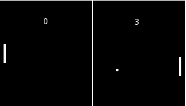
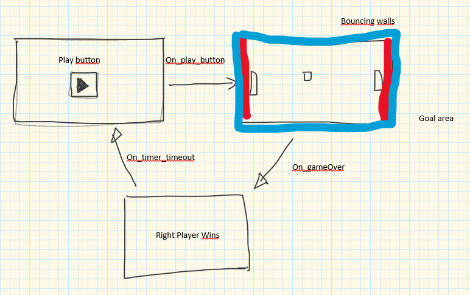
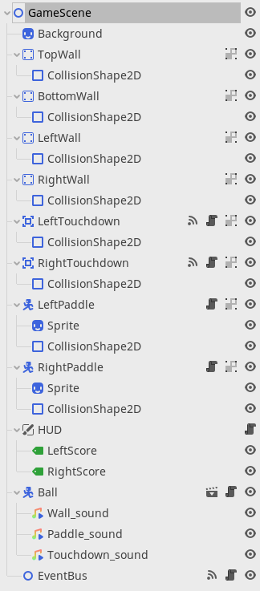
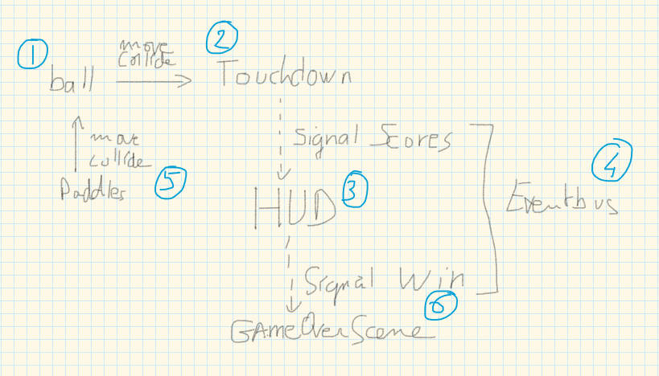
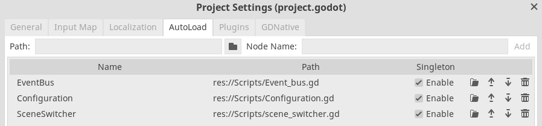

# Godot Beginner's Game Development

[Godot](https://godotengine.org/) is an open-source game engine for 2D and 3D game development. 
Its intuitive design makes it a nice choice for beginners. As a beginner game developer, 
I would like to document how to approach Godot while developing a very simple game for training 
purposes. Although many very good game development tutorials exist out there, it doesn't teach 
you how to code your project. 

Before diving into this demo project, I read the Godot 
[documentation](https://docs.godotengine.org/en/stable/), 
watch and code different tutorials (such as [GDQuest](https://www.youtube.com/channel/UCxboW7x0jZqFdvMdCFKTMsQ) 
and [UmaiPixel](https://www.youtube.com/channel/UCla6BhPwo5zGal6vR5le4YA) ). These resources 
help in understanding how the different pieces of the game engine work.

## Game description
The demo project that I have chosen is Pong. This is a very basic game without many graphic 
assets to produce, very simple controls (2 directions), and only one game scene to code.  


Besides, the _GameScene_ we also need a _StartScene_ as thea main screen with a play button and a _GameOverScene_
 to display the winner of the game.



## Game Assets
From a bird eyes, a Godot project is composed of **Scenes** displayed to the user. These Scenes are 
composed of Objects organized into a Graph. The root node of the Graph is a generic **Node** of type 
**Control** for UI screens, **Node3D** for 3D games screens or **Node2D** for 2D games. Every game
assets are organized into a tree-like structure that begins with the chosen root node.

To develop this Pong game we need:  

1. For the _GameScene_:
    * A background sprite of 320 pixels width by 180 pixels height
    * A white paddle of 32 by 32 pixels
    * A white ball of 8 by 8 pixels
    * A paddle sound
    * A wall sound
    * A touchdown sound when the ball hit the goals
    
2. For the _StartScene_:
    * A white triangle play button of 32 by 32 pixels

## Scene design

### GameScene

* background **Sprite**
* 4 **[StaticBody2D](https://docs.godotengine.org/en/stable/classes/class_staticbody2d.html?highlight=StaticBody2D)** for the walls
* 2 **[Area2D](https://docs.godotengine.org/en/stable/classes/class_area2d.html?highlight=Area2D)** for Left and Right Touchdown areas
* 2 **[KinematicBody2D](https://docs.godotengine.org/en/stable/classes/class_kinematicbody2d.html?highlight=KinematicBody2D)** for left and right paddles
* 1 **[KinematicBody2D](https://docs.godotengine.org/en/stable/classes/class_kinematicbody2d.html?highlight=KinematicBody2D)** for the ball
* 1 **[CanvasLayer](https://docs.godotengine.org/en/stable/classes/class_canvaslayer.html?highlight=CanvasLayer)** for the scores **[Label](https://docs.godotengine.org/en/stable/classes/class_label.html?highlight=Label)**



### StartScene

* background **Sprite**
* **[TextureButton](https://docs.godotengine.org/en/stable/classes/class_texturebutton.html?highlight=TextureButton)**

### GameOverScene

* background **Sprite**
* 1 **CanvasLayer** for a text **Label**
* 1 **Timer** to return to the StartScene

## Scripts interactions

Once the different objects of the scenes have been placed, I have created scripts attached to reacting objects:
* Ball.gd
* HUD.gd
* LeftPaddle.gd
* RightPaddle.gd



The ball moves constantly and eventually hit a wall. If the ball hits the left or right walls, it's a touchdown.
Upon touchdown, the score of the opposing camp is incremented by 1. The scores are displayed by the HUD. When one
of the scores is equal to 10, the game is over and the scene change to the GameOverScene. The GameOverScene displays
the name of the winner. Paddles are allowed to move up and down to protect their touchdown area from the ball. 

### Event Bus

As sketched above, touchdown events can send a signal for scores. This follows the observer pattern recommended by Godot 
[documentation](https://docs.godotengine.org/en/stable/getting_started/step_by_step/signals.html). Indeed, instead 
of continuous monitoring for score updates, the observer pattern allows updating scores
only when a specific signal is present. The same pattern was imagined for the GameOverScene, however, after experimentation,
this was not the retained mechanism for changing scene, as explained later. The scoring logic and game end are coded into
an "Event_bus.gd" script.

### Global Constants

Common variables are stored in a _Configuration.gd_ script:  
```GDScript
extends Node

# Define global constants
const BALL_SPEED = 150
const PAD_SPEED = 130


# Define paddle movements
enum pad_movements {UP, DOWN}
```
Authorized movements for both paddles are also referenced into a _pad_movements_ **enum**. I have followed Godot's
[best practices](https://docs.godotengine.org/en/stable/getting_started/workflow/best_practices/autoloads_versus_internal_nodes.html)
using the **Autoload** feature for global access to these Configuration constants.


## Script development

### 1. Ball

The first mobile game element is the ball. It's movement speed is defined in a Configuration global variable:

```GDScript
export var speed = Configuration.BALL_SPEED 
var velocity = Vector2(speed, speed)
```

At game start, we place the ball at the center of the viewport:

```GDScript
func _ready():
	var center = get_viewport_rect().size / 2
	position = center
```

The ball should bounce on walls and paddles:

```GDScript
func _physics_process(delta):
	var collision = move_and_collide(velocity * delta)
	if collision:
		velocity = velocity.bounce(collision.normal)
```

The ball is a KinematicBody2D that have a _physic_process_ method that is called during the physic processing step
of the main loop and allows to sync the frame rate on the physics (constant delta variable). Both walls and paddles
have a CollisionShape2D that react to the ball. On collision, the normal vector to the direction of the ball is fed back
to the velocity vector. Another interesting feature of the **[KinematicCollision2D](https://docs.godotengine.org/en/stable/classes/class_kinematiccollision2d.html?highlight=KinematicCollision2D)**
is the stored **collider**. We can play different audio sounds depending on the _collider.name_ : 

```GDScript
		# audio
		if collision.collider.name == "RightWall" || collision.collider.name == "LeftWall": 
			$Touchdown_sound.play()
		elif collision.collider.name == "LeftPaddle" || collision.collider.name == "RightPaddle":
			$Paddle_sound.play()
		elif collision.collider.name == "TopWall" || collision.collider.name == "BottomWall":
			$Wall_sound.play()
```

### 2. Touchdown

The goal of the game is to record the number of times the ball hit the *LeftWall* and *RightWall*. I have implemented
this feature using the **body_entered()** method from the **Area2D** class. This method emit a signal that was 
connected to the _Event_bus.gd_ script: 

```GDScript
# signals
signal right_score_value(value)
signal left_score_value(value)

# Status Variables
var left_score = -1
var right_score = -1
const win = 10
var winner

func _on_LeftTouchdown_body_entered(body):
	var name = body.get_name()
	if name == "Ball":
		right_score += 1
		print_debug("Right score: ", right_score)
		emit_signal("right_score_value", right_score)

func _on_RightTouchdown_body_entered(body):
	var name = body.get_name()
	if name == "Ball":
		left_score += 1
		print_debug("Left score: ", left_score)
		emit_signal("left_score_value", left_score)
```

These two methods record the left and right scores and emit two new signals. Signals can pass parameters to the 
receiver methods. 

### 3. Head-Up Display (HUD)

The two custom signals created in the _Event_bus.gd_ script were connected to the _HUD.gd_ script:

```GDScript
func _on_EventBus_left_score_value(value):
	$LeftScore.text = str(value)
	print_debug("update left score")

func _on_EventBus_right_score_value(value):
	$RightScore.text = str(value)
	print_debug("Update right score")
```
The recieved scores are used to update the left and right displays.

### 4. Paddle movements

Paddles can be controlled by a player with a keyboard or by the game itself. However, the paddle movement is the same
and the _physics_process_ can be implemented into a parent class common to the right and left Paddles.

```GDScript
extends KinematicBody2D

var dir = Configuration.pad_movements
var speed = Configuration.PAD_SPEED

func _physics_process(delta):
	var velocity = Vector2()
	var inputs = get_inputs()
	for i in inputs:
		match i : 
			dir.DOWN: velocity.y += 1
			dir.UP: velocity.y -= 1
	move_and_collide(velocity * speed * delta)
	
func get_inputs():
	pass
```

Child classes need to override the _get_inputs_ method. For the **LeftPaddle**, it's the keyboard inputs that
move the paddle.

```GDScript
extends "res://Scripts/Paddle.gd"

func get_inputs():
	var inputs = []
	if Input.is_action_pressed("ui_down"):
		inputs.append(dir.DOWN)
	if Input.is_action_pressed("ui_up"):
		inputs.append(dir.UP)
	return inputs
```
This function is passing an array of directions in case we want to increase the number of possible inputs and 
combinations of inputs.

The simplest algorithm for the computer-controlled **RightPaddle** is to mimic the ball movement on the y-axis.

```GDScript
extends "res://Scripts/Paddle.gd"

var ball

func _ready():
	ball = get_parent().get_node("Ball")

func get_inputs():
	var inputs = []
	if ball.velocity.y < 0:
		inputs.append(dir.UP)
	if ball.velocity.y > 0:
		inputs.append(dir.DOWN)
	return inputs
```

### 5. GameOverScene

I have first tested sending a signal for the GameOverScene, however, I discovered that signals cannot travel across 
scenes after calling the **change_scene** method. I also tested the retrieving of the scores from the EventBus, but
this approach did not work either because of the **Event_bus.gd** script is re-initialized upon scene change. Thus the 
scores are reset.
The most successful approach was to pass a parameter during **change_scene**. However, Godot's **SceenTree.change_scene**
method does not allow parameter passing. Fortunately, Zylann designed an elegant solution for an extended [SceneSwitcher](https://godotengine.org/qa/1883/transfering-a-variable-over-to-another-scene):

```GDScript
extends Node

# private var
var _params = null

func change_scene(next_scene, params=null):
	_params = params
	get_tree().change_scene(next_scene)
	
func get_params(name):
	if _params != null && _params.has(name):
		return _params[name]
	else:
		return null
```
This SceneSwicher is registered as an AutoLoad script for passing parameters.

## Conclusion

During this demo project, I learn about:  

* AutoLoads to store data across different scripts
* Signals to simplify the logic between scripts
* The limitations of the change_scene mecanism

Overall, Godot is a very good game engine for small projects by beginners. 